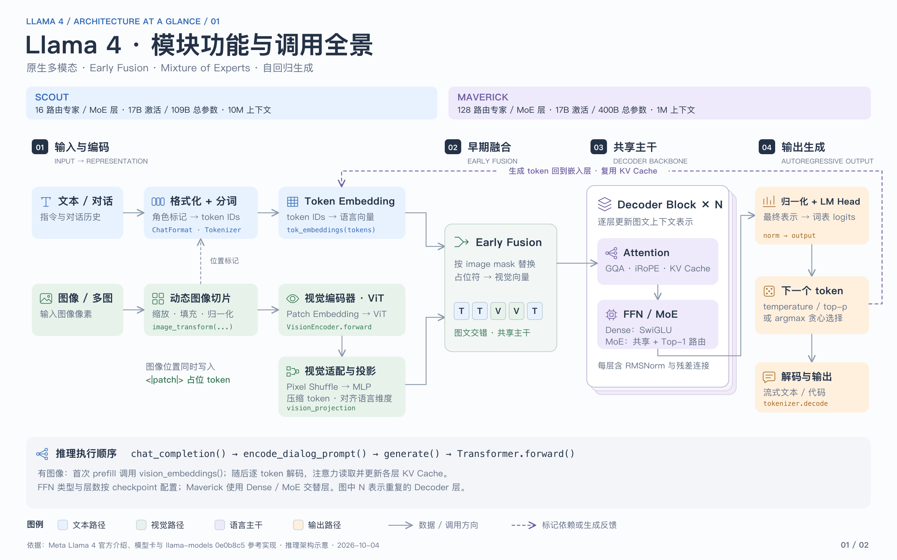
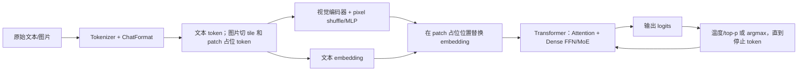

# 手搓 Llama 4：项目框架

目标：以 `../llama-models/models/llama4/` 的**完整推理代码**为参照，自己实现全部代码路径：文本主干、MoE、视觉、Tokenizer、对话格式、生成、原生 checkpoint、模型并行、FP8/Int4 量化与命令行入口。只规划和编写代码；本路线图不安排下载权重、运行模型或推理验证。

逐文件任务见 [TODO.md](TODO.md)。本目录目前只放路线图；下方 `src/` 是建议你后续亲手创建的结构。这里的“完整版”指当前仓库的 Llama 4 **推理实现**，不扩展到仓库未提供的训练系统。



## 源码地图

仓库中 `llama-models/llama_models` 是指向 `models` 的符号链接，所以 `llama_models/datatypes.py` 与 `models/datatypes.py` 是同一个文件。`models/llama4/` 放 Llama 4 专用实现；Llama 4 还会导入上一级的共享模块。下面两份 `datatypes.py` 职责不同，均属于完整推理路径。

| 参考文件 | 作用 | 建议对应模块 |
| --- | --- | --- |
| [`args.py`](../llama-models/models/llama4/args.py) | 文本、MoE、视觉、量化参数及校验 | `src/my_llama/config.py` |
| [`../datatypes.py`](../llama-models/models/datatypes.py) | 跨模型共用的消息/图文内容、工具调用、停止原因、流式生成结果与量化模式；Llama 4 的 `chat_format.py`、`generation.py` 等直接导入 | `src/my_llama/types.py`、`chat.py`、`generate.py`、`quantization/loader.py` |
| [`datatypes.py`](../llama-models/models/llama4/datatypes.py) | tokens、图像 embedding、logits 的输入输出约定 | `src/my_llama/types.py` |
| [`model.py`](../llama-models/models/llama4/model.py) | RMSNorm、RoPE、GQA 注意力、KV cache、Transformer block、文本主干、分块 mask | `layers.py`、`attention.py`、`model.py` |
| [`ffn.py`](../llama-models/models/llama4/ffn.py) | SwiGLU dense FFN | `layers.py` |
| [`moe.py`](../llama-models/models/llama4/moe.py) | top-k router、共享专家、路由专家 | `moe.py` |
| [`tokenizer.py`](../llama-models/models/llama4/tokenizer.py) | tiktoken BPE、特殊 token、停止 token | `tokenizer.py` |
| [`chat_format.py`](../llama-models/models/llama4/chat_format.py)、[`prompt_format.md`](../llama-models/models/llama4/prompt_format.md) | 消息模板、图片占位 token、图文交错 | `chat.py` |
| [`preprocess.py`](../llama-models/models/llama4/preprocess.py) | 图片缩放、补边、切 tile、归一化 | `vision/preprocess.py` |
| [`vision/encoder.py`](../llama-models/models/llama4/vision/encoder.py)、[`vision/embedding.py`](../llama-models/models/llama4/vision/embedding.py) | patch/视觉 Transformer、pixel shuffle/MLP、散射回文本位置 | `vision/encoder.py`、`vision/fusion.py` |
| [`generation.py`](../llama-models/models/llama4/generation.py) | checkpoint 装载、prefill/decode、batch、采样、停止 | `generate.py`、`checkpoint.py` |
| [`../checkpoint.py`](../llama-models/models/checkpoint.py) | 原生多卡分片重排 | `checkpoint.py` |
| [`quantization/loader.py`](../llama-models/models/llama4/quantization/loader.py)、[`scripts/quantize.py`](../llama-models/models/llama4/scripts/quantize.py) | FP8/Int4 权重量化与加载 | `quantization/loader.py`、`scripts/quantize.py` |
| [`scripts/completion.py`](../llama-models/models/llama4/scripts/completion.py)、[`scripts/chat_completion.py`](../llama-models/models/llama4/scripts/chat_completion.py) | 文本和图文命令行入口 | `scripts/` |

## 一次推理的数据流



文本最短路径：`token IDs → embedding → N 个 block → RMSNorm → lm head → logits`。解码时首轮对 prompt 做 prefill，随后每次只输入新 token，过去的 K/V 从 cache 读取。

## 建议的手搓目录

```text
my-llama/
├── README.md                 # 这份结构说明
├── TODO.md                   # 逐模块代码清单与静态覆盖检查
├── pyproject.toml            # 依赖和命令行入口
├── src/my_llama/
│   ├── config.py             # 参数和约束
│   ├── types.py              # 输入输出结构
│   ├── parallel.py           # 分布式初始化和模型并行层
│   ├── layers.py             # RMSNorm、RoPE、SwiGLU
│   ├── attention.py          # GQA、iRoPE、mask、KV cache
│   ├── moe.py                # router、共享/路由专家
│   ├── model.py              # block 和完整 Transformer
│   ├── tokenizer.py          # BPE 与特殊 token
│   ├── chat.py               # 消息/图片占位编码
│   ├── generate.py           # prefill/decode、采样和停止
│   ├── checkpoint.py         # 原生权重名称映射、分片装载
│   ├── quantization/
│   │   └── loader.py         # FP8/Int4 权重转换与加载
│   ├── scripts/
│   │   ├── completion.py
│   │   ├── chat_completion.py
│   │   └── quantize.py
│   └── vision/
│       ├── preprocess.py     # 图片 resize、pad、tile
│       ├── encoder.py        # patch embedding + ViT
│       └── fusion.py         # pixel shuffle、投影和占位替换
└── notes/                   # 可选：权重键映射、shape 与源码差异笔记
```

## 实现时必须看清的约定

1. **Attention**：Q 头数可大于 K/V 头数；K/V 按组复用。文本层交替使用 RoPE 层与 NoPE 层；NoPE 层走全局因果注意力，RoPE 层可用 chunk 局部因果 mask。`attn_temperature_tuning` 只作用在 NoPE 层。详见 `model.py` 的 `Attention`、`TransformerBlock` 和 `create_chunked_attention_mask`。
2. **MoE**：不是纯 top-k 专家输出；还有一个始终参与的共享 SwiGLU 专家。参考实现先选 top-k router logit，再对选中项做 sigmoid，专家结果与共享专家结果相加。完整复现时还需保留专家批量布局及模型并行归约。
3. **图片是 early fusion**：图片先变成 tile，经视觉编码和 pixel shuffle/MLP 压缩为 patch embedding；`<|patch|>` 位置的文本 embedding 被视觉 embedding 替换。多 tile 时还会有一张全局缩放图；占位 token 数必须与实际投影后的 patch 数匹配。
4. **原生运行依赖也是代码的一部分**：参考实现依赖 CUDA、NCCL、FairScale 和量化库，部分模块初始化时直接调用 `.cuda()`。目录中的 `parallel.py` 和 `checkpoint.py` 要明确这些接口、切分方式和权重键映射。
5. **完成标准按源码覆盖**：每个公开类/函数、分支、张量 shape、权重转换 hook 与 CLI 参数都能在自己的代码或笔记中找到对应；TODO 以静态代码审阅勾选。

## 推荐阅读顺序

`args.py → datatypes.py → model.py → ffn.py → moe.py → tokenizer.py → chat_format.py → generation.py → preprocess.py → vision/* → checkpoint.py → quantization/*`。

若打算使用或分发原生模型材料，先读仓库中的 [Llama 4 许可证](../llama-models/models/llama4/LICENSE) 与 [使用政策](../llama-models/models/llama4/USE_POLICY.md)。
